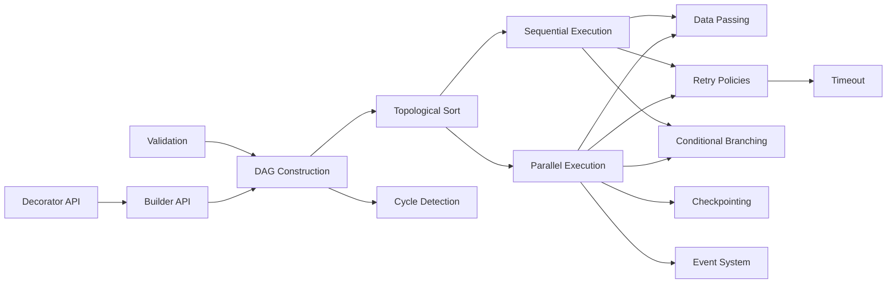
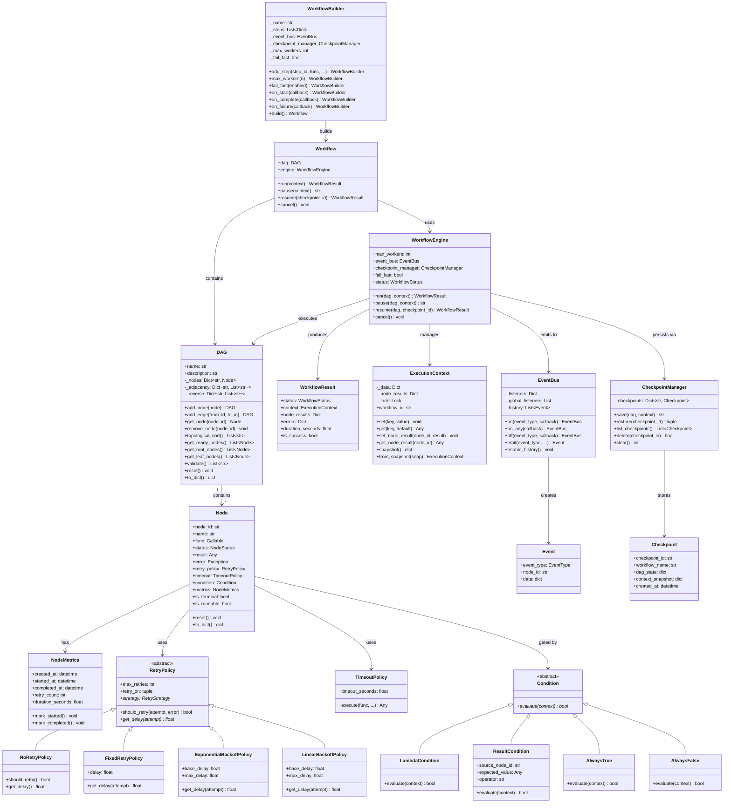
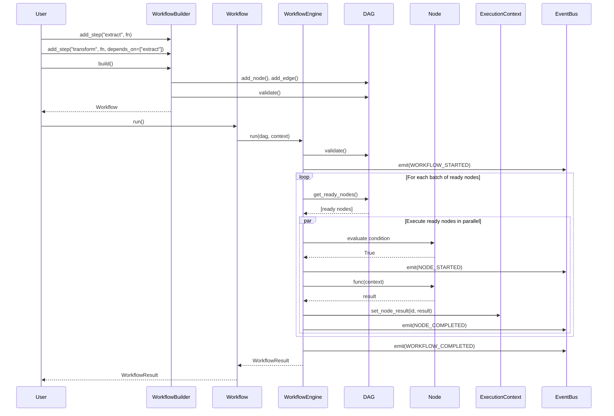
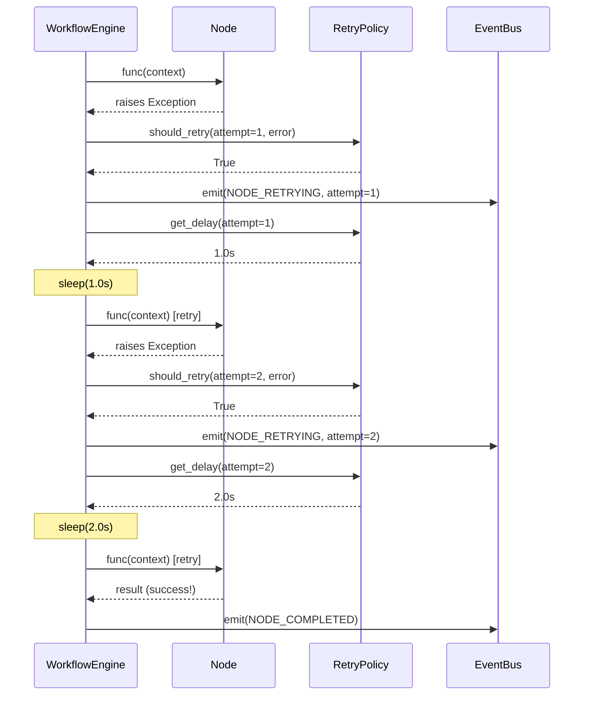
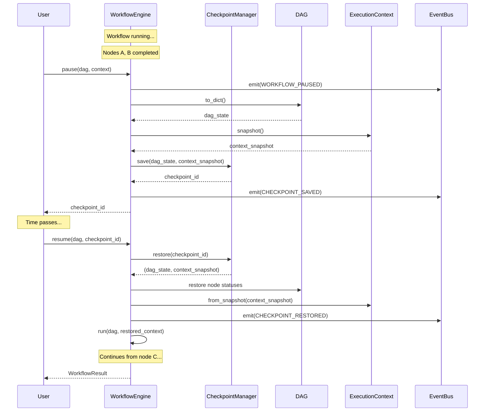
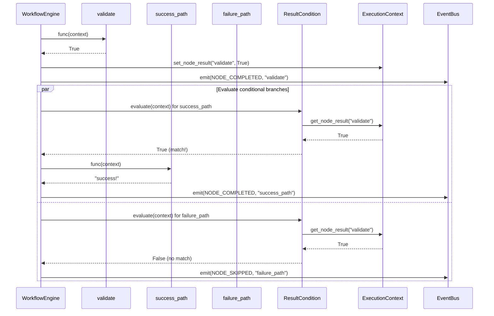
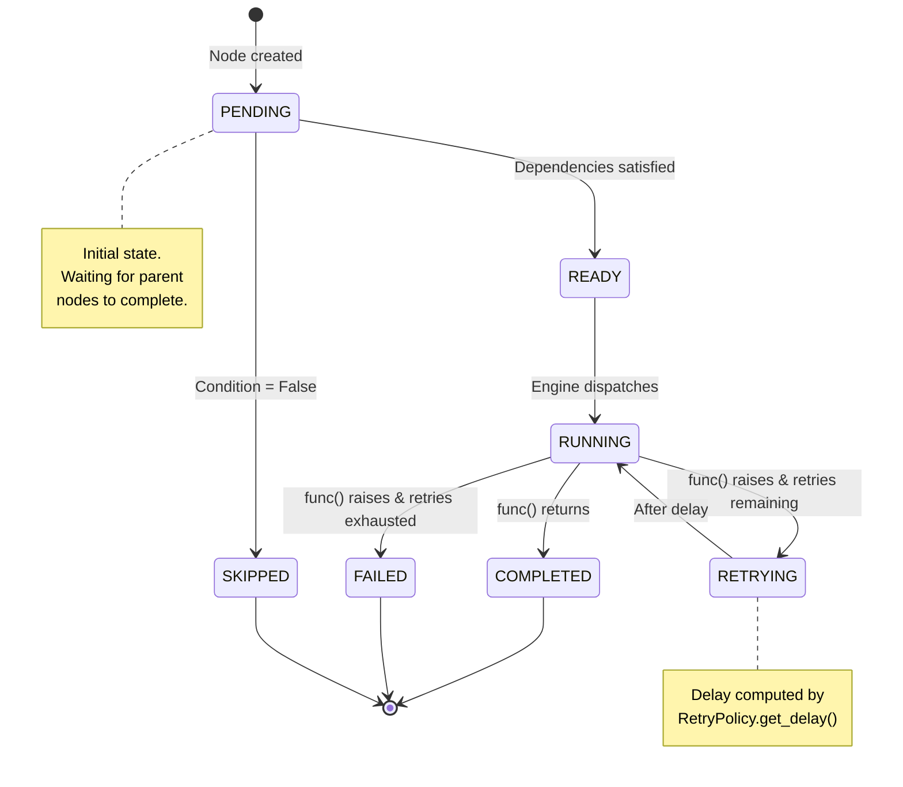
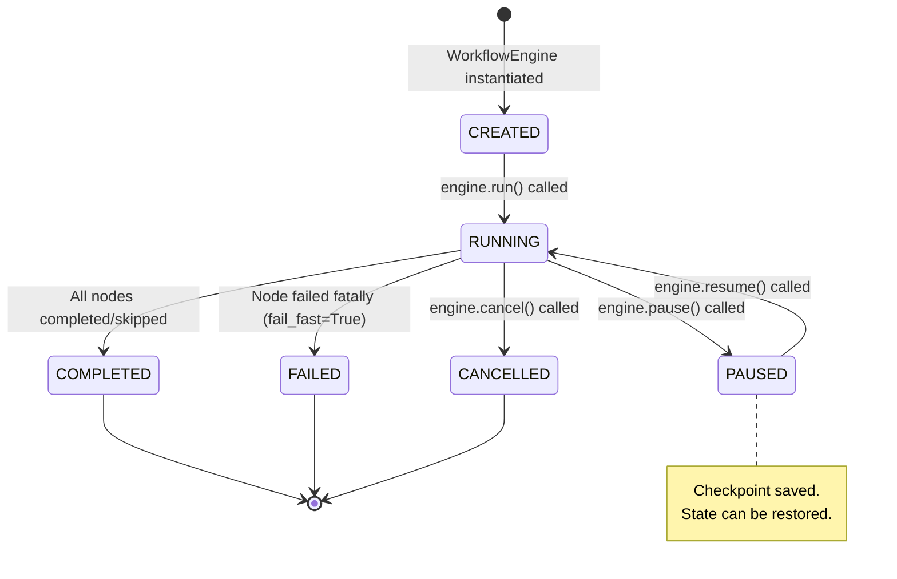
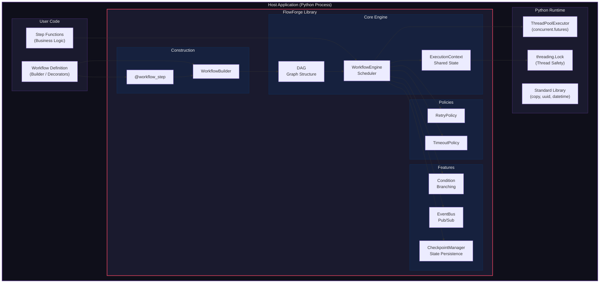
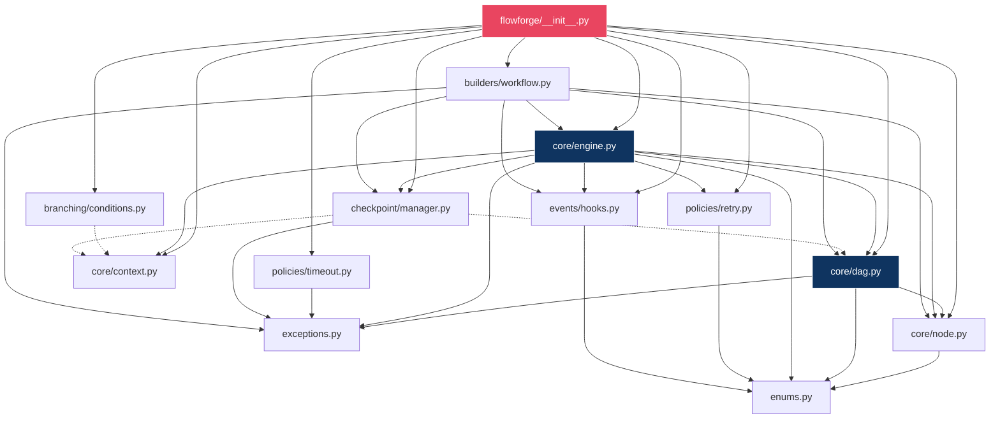

# FlowForge — Architecture Report

## 1. Executive Summary

FlowForge is a lightweight, embeddable Python library that enables developers to define, execute, and manage multi-step workflows as Directed Acyclic Graphs (DAGs). The engine provides parallel execution, configurable retry policies, conditional branching, in-memory checkpointing, and a publish/subscribe event system — all with **zero external dependencies**.

This document provides the complete architectural blueprint of the component, including functional overview, technical and business restrictions, and comprehensive UML-style diagrams rendered in Mermaid.js.

---

## 2. Component Functions

### 2.1 Core Functions

| # | Function | Description |
|---|----------|-------------|
| F1 | **DAG Construction** | Define workflow steps as nodes and their dependencies as directed edges |
| F2 | **Topological Scheduling** | Automatically determine valid execution order using Kahn's algorithm |
| F3 | **Cycle Detection** | DFS-based cycle detection prevents invalid dependency graphs |
| F4 | **Parallel Execution** | Independent nodes execute concurrently via thread pool |
| F5 | **Sequential Execution** | Dependent nodes execute in topological order |
| F6 | **Data Passing** | Thread-safe execution context allows data flow between nodes |
| F7 | **Retry Policies** | Configurable retry strategies (fixed, exponential, linear backoff) |
| F8 | **Timeout Enforcement** | Maximum execution duration per node |
| F9 | **Conditional Branching** | Runtime conditions gate node execution (skip or proceed) |
| F10 | **Checkpointing** | Save and restore workflow state for pause/resume |
| F11 | **Event System** | Pub/sub hooks for lifecycle monitoring |
| F12 | **Fluent Builder API** | Chainable API for workflow construction |
| F13 | **Decorator API** | `@workflow_step` decorator for declarative step registration |
| F14 | **Workflow Validation** | Comprehensive pre-execution validation |

### 2.2 Function Dependency Matrix

---

## 3. Technical Restrictions

| ID | Restriction | Impact | Mitigation |
|----|-------------|--------|------------|
| TR-1 | **Python ≥ 3.9 required** | Uses `typing` features and `datetime.fromisoformat()` | Documented in installation requirements |
| TR-2 | **Single-process execution** | Thread pool is bound to the host process; no cross-machine distribution | Architecture supports future pluggable executors |
| TR-3 | **GIL limitation** | Python's GIL means CPU-bound nodes won't achieve true parallelism | Use for I/O-bound tasks; document recommendation |
| TR-4 | **In-memory checkpoints** | Checkpoints are lost on process termination | Extensible `CheckpointManager` supports future persistent backends |
| TR-5 | **Synchronous node callables** | All node functions must be synchronous (not `async`) | Could be extended with `asyncio` executor |
| TR-6 | **Thread-safety of user code** | Node functions must be thread-safe when sharing mutable state | `ExecutionContext` provides thread-safe `set`/`get` |
| TR-7 | **No circular dependencies** | DAG structure inherently prohibits cycles | Validated at edge-addition time with DFS |

---

## 4. Business Restrictions

| ID | Restriction | Rationale |
|----|-------------|-----------|
| BR-1 | **No GUI / Dashboard** | Library component — visual tools are consumer-facing applications |
| BR-2 | **No authentication / authorisation** | Out of scope for an embeddable library |
| BR-3 | **No persistent storage** | Keeps the component lightweight and dependency-free |
| BR-4 | **No network protocols** | FlowForge is an in-process engine, not a service |
| BR-5 | **No scheduling (cron-like)** | Trigger mechanisms are the host application's responsibility |
| BR-6 | **English-only API** | Method names, exceptions, and docs in English |

---

## 5. Class Diagram

---

## 6. Sequence Diagrams

### 6.1 Normal Workflow Execution

### 6.2 Retry Flow

### 6.3 Checkpoint / Resume Flow

### 6.4 Conditional Branching Flow

---

## 7. State Diagrams

### 7.1 Node Lifecycle

### 7.2 Workflow Lifecycle

---

## 8. Deployment Diagram

---

## 9. Design Patterns Used

| Pattern | Where | Purpose |
|---------|-------|---------|
| **Builder** | `WorkflowBuilder` | Fluent construction of complex DAG + Engine configuration |
| **Strategy** | `RetryPolicy` hierarchy | Interchangeable retry delay algorithms |
| **Observer** | `EventBus` | Decouple lifecycle monitoring from execution logic |
| **Template Method** | `WorkflowEngine._execute_node()` | Fixed algorithm with extension points (condition, retry, timeout) |
| **Memento** | `CheckpointManager` / `Checkpoint` | Capture and restore workflow state without violating encapsulation |
| **Decorator** | `@workflow_step` | Transparently augment functions with step metadata |
| **Chain of Responsibility** | Condition composites (`AND`, `OR`, `NOT`) | Composable condition evaluation chains |
| **Facade** | `Workflow` class | Simplified interface over DAG + Engine + Context |

---

## 10. Package Dependency Graph

---

## 11. Thread Safety Analysis

| Component | Thread Safety Mechanism | Notes |
|-----------|------------------------|-------|
| `ExecutionContext` | `threading.Lock` on all `_data` and `_node_results` access | All public methods are thread-safe |
| `WorkflowEngine` | `threading.Lock` on `_errors` dict | Cancel/pause use `threading.Event` |
| `EventBus` | Listeners invoked synchronously within the emitting thread | Error-safe: listener exceptions are caught and logged |
| `Node` | Mutable state accessed only by the engine's scheduling loop | Each node is dispatched to at most one thread at a time |
| `CheckpointManager` | Not thread-safe by design | Intended to be called from the engine (single-threaded control flow) |

---

*Document generated for FlowForge v1.0.0*
