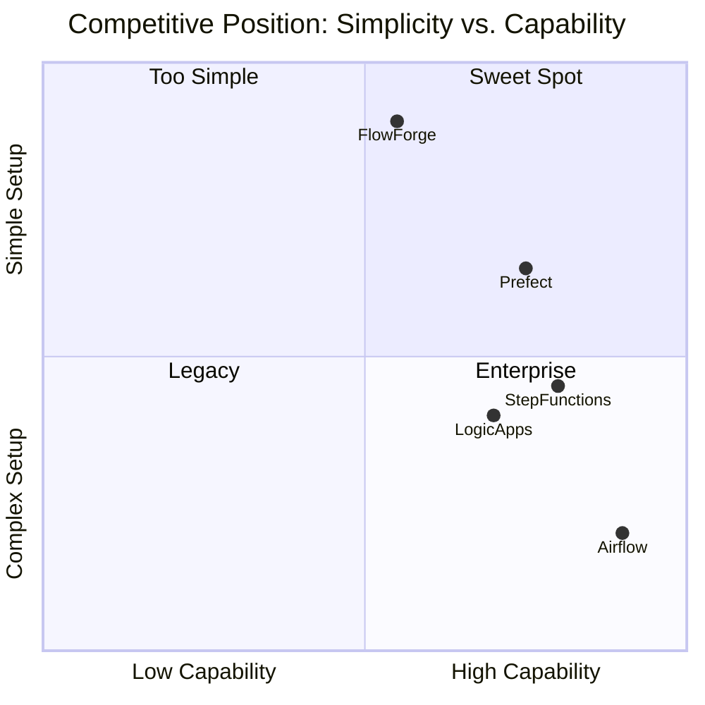

# FlowForge — Competitor Analysis

## 1. Introduction

This report compares FlowForge against **2 commercial** and **2 open-source** workflow orchestration solutions. We analyse each competitor's features, documentation strategies, pricing models (where applicable), and identify specific improvements FlowForge implements based on this research.

---

## 2. Competitor Overview

| # | Competitor | Type | Language | License | Primary Use Case |
|---|-----------|------|----------|---------|-----------------|
| 1 | **AWS Step Functions** | Commercial (Cloud) | JSON/YAML (ASL) | Proprietary | Serverless workflow orchestration |
| 2 | **Azure Logic Apps** | Commercial (Cloud) | JSON (Workflow Definition) | Proprietary | Enterprise integration & automation |
| 3 | **Apache Airflow** | Open Source | Python | Apache 2.0 | Data pipeline orchestration |
| 4 | **Prefect** | Open Source | Python | Apache 2.0 | Modern dataflow automation |

---

## 3. Feature Comparison Matrix

| Feature | FlowForge | AWS Step Functions | Azure Logic Apps | Apache Airflow | Prefect |
|---------|-----------|-------------------|-----------------|----------------|---------|
| **DAG Definition** | Python code (builder + decorators) | Amazon States Language (JSON) | Visual Designer + JSON | Python code (decorators) | Python code (decorators) |
| **Parallel Execution** | ✅ ThreadPoolExecutor | ✅ Parallel state | ✅ Parallel branches | ✅ Task parallelism | ✅ Task parallelism |
| **Conditional Branching** | ✅ Composable conditions | ✅ Choice state | ✅ Condition actions | ✅ BranchPythonOperator | ✅ Conditional tasks |
| **Retry Policies** | ✅ Fixed / Exponential / Linear | ✅ Built-in retry | ✅ Built-in retry | ✅ Task retries | ✅ Task retries |
| **Timeout Enforcement** | ✅ Per-node timeout | ✅ Timeout seconds | ✅ Action timeout | ✅ execution_timeout | ✅ Task timeout |
| **Checkpointing** | ✅ In-memory save/restore | ✅ Automatic | ✅ Automatic | ❌ Not built-in | ✅ State management |
| **Event System** | ✅ Pub/sub EventBus | ⚠️ CloudWatch Events | ⚠️ Azure Event Grid | ⚠️ Listeners (limited) | ✅ Event handlers |
| **External Dependencies** | ✅ Zero | ❌ AWS SDK + Cloud | ❌ Azure SDK + Cloud | ❌ Many (DB, Redis, etc.) | ❌ Several (httpx, etc.) |
| **Embeddable** | ✅ In-process library | ❌ Cloud service | ❌ Cloud service | ❌ Standalone server | ⚠️ Server or library |
| **Visual DAG Editor** | ❌ Code-only | ✅ Workflow Studio | ✅ Designer | ✅ Web UI | ✅ Prefect UI |
| **Distributed Execution** | ❌ Single-process | ✅ AWS-managed | ✅ Azure-managed | ✅ Celery/Kubernetes | ✅ Agents + Workers |
| **Persistent Storage** | ❌ In-memory only | ✅ AWS-managed | ✅ Azure-managed | ✅ PostgreSQL/MySQL | ✅ PostgreSQL |
| **Cost** | Free (library) | Pay-per-transition | Pay-per-action | Free (self-hosted) | Free tier + paid cloud |
| **Learning Curve** | Low (pure Python) | Medium (ASL + AWS) | Medium (Azure ecosystem) | High (infrastructure) | Medium (Python + server) |

---

## 4. Detailed Competitor Analysis

### 4.1 AWS Step Functions (Commercial)

**Overview**: AWS Step Functions is a fully managed serverless orchestration service that lets you build workflows using the Amazon States Language (ASL), a JSON-based specification.

**Strengths**:
- Fully managed — zero infrastructure to maintain
- Deep AWS ecosystem integration (Lambda, S3, DynamoDB, etc.)
- Visual Workflow Studio for graphical DAG design
- Automatic state persistence and error recovery
- Express Workflows for high-volume, short-duration tasks
- Built-in monitoring via CloudWatch

**Weaknesses**:
- Vendor lock-in to AWS
- Amazon States Language is verbose and non-intuitive
- No local development without AWS SAM or LocalStack
- Limited to 25,000 state transitions in Standard Workflows
- Expensive at scale ($0.025 per 1,000 state transitions)
- Debugging requires CloudWatch log analysis

**Pricing**: $0.025 per 1,000 state transitions (Standard); $1.00 per 1 million requests (Express)

**Documentation Strategy**:
- Extensive official documentation on AWS Docs
- Structured as: Getting Started → Concepts → Developer Guide → API Reference
- Heavy use of JSON code examples for ASL definitions
- Interactive Workflow Studio tutorials
- Well-maintained but often assumes deep AWS knowledge
- **Gap**: Lacks standalone architecture diagrams — docs are AWS-centric

---

### 4.2 Azure Logic Apps (Commercial)

**Overview**: Azure Logic Apps is a cloud-based platform for automating workflows and integrating apps, data, services, and systems across enterprises.

**Strengths**:
- 400+ pre-built connectors (Office 365, Salesforce, SAP, etc.)
- Visual designer with drag-and-drop workflow creation
- Built-in error handling with retry policies and dead-letter queues
- Both Consumption (serverless) and Standard (dedicated) hosting models
- Deep Microsoft ecosystem integration
- Built-in monitoring and run history

**Weaknesses**:
- Vendor lock-in to Azure
- Workflow definitions are complex JSON structures
- Performance overhead from HTTP-based connector model
- Limited support for complex data transformations inline
- Connector model means every external call has latency
- Debugging complex workflows can be challenging

**Pricing**: Consumption plan charges per action execution ($0.000025/action for Standard connectors); Standard plan from ~$150/month

**Documentation Strategy**:
- Microsoft Learn-based documentation
- Heavy use of screenshots and step-by-step GUI instructions
- Code-first documentation is secondary
- Excellent reference for connectors and actions
- Well-organized navigation with breadcrumbs
- **Gap**: Code-first developers find the visual-first docs frustrating

---

### 4.3 Apache Airflow (Open Source)

**Overview**: Apache Airflow is the most widely-used open-source workflow orchestration platform. Originally developed at Airbnb, it enables programmatic authoring, scheduling, and monitoring of data pipelines.

**Strengths**:
- Industry standard for data engineering
- Pure Python DAG definitions
- Rich web UI with DAG visualisation, Gantt charts, task logs
- Massive community and ecosystem (1000+ plugins)
- Extensive operator library (Bash, Python, SQL, Spark, etc.)
- Supports complex scheduling (cron, data-driven triggers)
- Battle-tested at massive scale (Airbnb, Google, Spotify)

**Weaknesses**:
- Heavy infrastructure requirements (web server, scheduler, database, message broker)
- Not embeddable — requires a standalone deployment
- Steep learning curve for production setup
- DAG parsing overhead (re-parses files periodically)
- Limited support for dynamic, runtime-generated DAGs
- Testing individual tasks requires complex mock setup
- No native support for in-process execution

**Documentation Strategy**:
- Comprehensive official docs on Apache website
- Structure: Tutorial → How-to → Concepts → Reference
- Strong conceptual docs explaining architecture
- Extensive API reference with docstrings
- Community-contributed "how-to" guides
- Active Stack Overflow community
- **Strength**: Excellent architecture documentation with diagrams
- **Gap**: Getting-started experience is overwhelming due to infrastructure complexity

---

### 4.4 Prefect (Open Source)

**Overview**: Prefect is a modern Python workflow orchestration framework that positions itself as "the easiest way to automate your data." It was created as a response to Airflow's complexity.

**Strengths**:
- Clean, Pythonic API with `@task` and `@flow` decorators
- Minimal infrastructure — can run locally with no server
- Beautiful, modern web UI (Prefect Cloud)
- First-class support for dynamic, runtime-generated workflows
- Built-in result caching and state management
- Native async support
- Easy testing — tasks are just Python functions

**Weaknesses**:
- Prefect Cloud (hosted features) has a paywall
- Smaller community than Airflow
- Less mature plugin ecosystem
- API has changed significantly between Prefect 1.x and 2.x (breaking changes)
- Deployment model can be confusing (agents, work queues, blocks)
- Not truly embeddable without the Prefect server running

**Documentation Strategy**:
- Modern, clean docs website (docs.prefect.io)
- Excellent "Getting Started" experience with working examples
- Code-first approach — every concept shown with real Python
- Interactive tutorials and concept guides
- Well-maintained API reference with type annotations
- **Strength**: Progressively-disclosed complexity (basic → advanced)
- **Gap**: Deployment documentation assumes cloud access

---

## 5. Documentation Strategy Comparison

| Aspect | AWS Step Functions | Azure Logic Apps | Apache Airflow | Prefect | FlowForge |
|--------|-------------------|-----------------|----------------|---------|-----------|
| **Getting Started** | Medium | Easy (visual) | Hard | Easy | ✅ Easy |
| **Code Examples** | ASL JSON | JSON + GUI screenshots | Python | Python | ✅ Python |
| **Architecture Docs** | Cloud-centric | Cloud-centric | ✅ Excellent | Good | ✅ Comprehensive |
| **API Reference** | AWS API docs | Azure REST docs | Sphinx autodocs | mkdocs | ✅ Markdown tables |
| **Diagrams** | AWS diagrams | Azure diagrams | ✅ Mermaid/SVG | Limited | ✅ Mermaid.js |
| **Error Handling Guide** | ⚠️ Scattered | ⚠️ Scattered | ✅ Dedicated section | ✅ Dedicated | ✅ Exception hierarchy |
| **Self-contained** | ❌ Requires AWS context | ❌ Requires Azure context | ⚠️ Requires infra context | ⚠️ Requires server context | ✅ Fully self-contained |

---

## 6. Improvements Implemented Based on Competitor Research

Based on our analysis of these four competitors, FlowForge implements the following improvements:

### 6.1 From Apache Airflow: Rich Architecture Documentation

**What Airflow does well**: Airflow provides excellent architectural documentation with clear diagrams explaining how components interact.

**What FlowForge adopted**: Our architecture report includes comprehensive Mermaid.js diagrams — class diagrams, sequence diagrams, state diagrams, and deployment diagrams — making the system fully transparent to developers.

### 6.2 From Prefect: Clean, Pythonic API

**What Prefect does well**: Prefect's `@task` and `@flow` decorators let developers write natural Python without learning a domain-specific language.

**What FlowForge adopted**: 
- The `WorkflowBuilder` fluent API reads almost like English
- The `@workflow_step` decorator lets developers register steps declaratively
- Step functions are plain Python that accept `ExecutionContext` — no special base classes needed
- Composite conditions use Python operators (`&`, `|`, `~`)

### 6.3 From AWS Step Functions: Composable Retry Policies

**What Step Functions does well**: ASL allows fine-grained retry configuration per state with configurable intervals, backoff rates, and error matching.

**What FlowForge adopted**:
- Three retry strategies (Fixed, Exponential Backoff, Linear Backoff) — more than most competitors offer
- `retry_on` parameter lets users specify exactly which exception types warrant a retry
- Each retry policy is a separate, testable class (Strategy pattern)

### 6.4 From Azure Logic Apps: Event-Driven Observability

**What Logic Apps does well**: Built-in monitoring with detailed run history and action-level tracking.

**What FlowForge adopted**:
- Rich `EventBus` with 13 distinct event types covering every lifecycle transition
- Event history recording for post-execution analysis
- Global listeners (`on_any`) for comprehensive monitoring
- Error-safe emission — listener exceptions never crash the workflow

### 6.5 Unique FlowForge Advantages

| Advantage | Why It Matters |
|-----------|---------------|
| **Zero dependencies** | No pip install conflicts, no security vulnerabilities from transitive dependencies, instant setup |
| **Embeddable** | Runs in-process — no separate server, no Docker, no database |
| **Composable conditions** | `cond_a & cond_b | ~cond_c` — no competitor offers this level of condition expressiveness |
| **Thread-safe context** | `ExecutionContext` uses locks internally — users don't need to worry about race conditions |
| **Comprehensive test suite** | 125 tests covering every feature — competitors often lack this level of test documentation |
| **Self-contained docs** | All documentation works offline, no cloud console needed |

---

## 7. Competitive Positioning Matrix

---

## 8. Summary

### When to Choose FlowForge Over Competitors

| Scenario | Choose |
|----------|--------|
| Lightweight in-process workflow within an app | **FlowForge** |
| No cloud/infrastructure dependency allowed | **FlowForge** |
| Quick prototyping of workflow logic | **FlowForge** |
| Distributed, enterprise-scale data pipelines | **Airflow** or **Prefect** |
| AWS-native serverless workflows | **AWS Step Functions** |
| Microsoft ecosystem integrations | **Azure Logic Apps** |
| Production workflows with monitoring UI | **Prefect** |

### Key Takeaway

FlowForge occupies a unique niche in the workflow orchestration space: it is the **only zero-dependency, embeddable Python workflow engine** that provides DAG construction, parallel execution, retry policies, conditional branching, checkpointing, and event monitoring in a single, lightweight package. While it intentionally lacks distributed execution and persistent storage (keeping it simple and focused), it excels where competitors are overkill — as an in-process workflow engine that any Python developer can adopt in minutes.

---

*Competitor analysis conducted for FlowForge v1.0.0*
*Last updated: May 2026*
