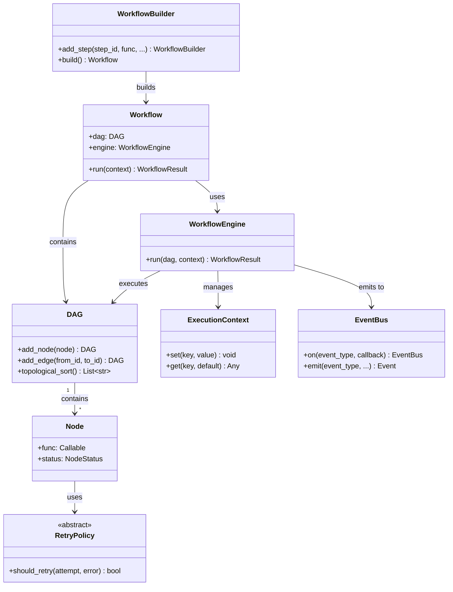
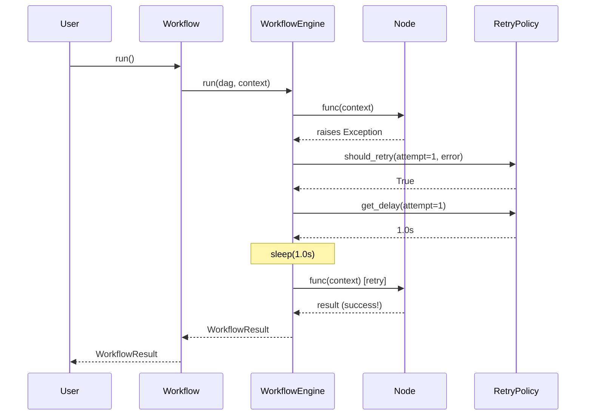
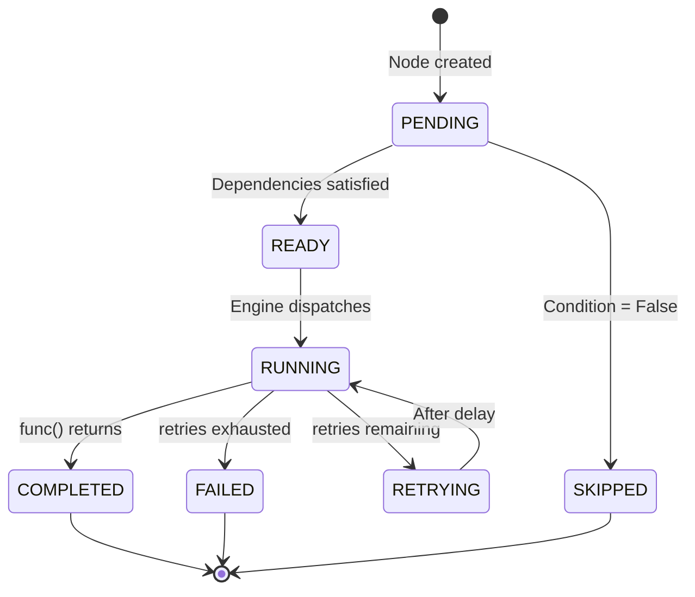
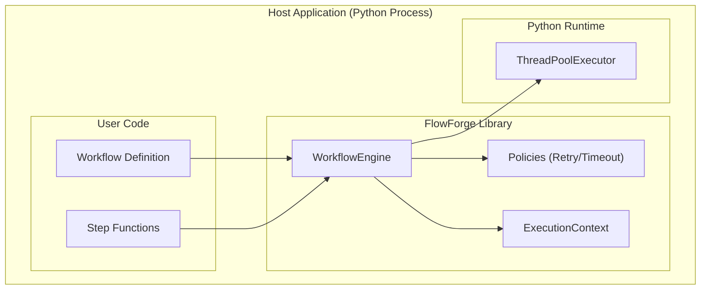
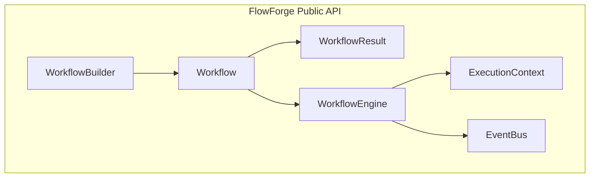

# FlowForge: Software Component Final Report

## 1. Component Description

### a. Provided Functions
FlowForge is a lightweight, embeddable Python library that provides the following core functions:
- **DAG Construction**: Define workflow steps as nodes and their dependencies as directed edges.
- **Topological Scheduling**: Automatically determine valid execution order using Kahn's algorithm.
- **Cycle Detection**: DFS-based cycle detection prevents invalid dependency graphs.
- **Parallel Execution**: Independent nodes execute concurrently via a built-in thread pool.
- **Sequential Execution**: Dependent nodes execute in strict topological order.
- **Data Passing**: Thread-safe execution context allows state flow between nodes.
- **Retry Policies**: Configurable retry strategies (fixed, exponential, linear backoff) for transient failures.
- **Timeout Enforcement**: Enforce maximum execution duration per node.
- **Conditional Branching**: Runtime conditions gate node execution (skip or proceed).
- **Checkpointing**: Save and restore workflow state for pause/resume capabilities.
- **Event System**: Pub/sub hooks for monitoring lifecycle transitions.
- **Fluent Builder API**: Chainable API for workflow construction.
- **Workflow Validation**: Comprehensive pre-execution structural validation.

### b. Purpose
The purpose of FlowForge is to provide developers with a simple, dependency-free mechanism to author and execute complex, multi-step programmatic workflows directly within their Python applications, without relying on heavy external infrastructure.

### c. Business Problems that Component Solves
- **Infrastructure Overhead**: Removes the need to deploy and manage heavy distributed orchestrators (like Apache Airflow or AWS Step Functions) for simple in-app pipelines.
- **Error Recovery in Data Processing**: Solves the problem of transient network failures failing entire pipelines by offering configurable node-level retries.
- **Concurrency Management**: Solves the complexity of managing thread pools and locks manually when executing independent tasks simultaneously.
- **Workflow Observability**: Provides deep visibility into internal application processes via a robust event bus system.

### d. Intended Use
FlowForge is intended to be embedded into larger Python applications (such as web servers, data processing scripts, or ETL pipelines). It is designed for developers who need to orchestrate dependent tasks (like fetching data, validating it, transforming it, and saving it) reliably and concurrently.

### e. Restrictions for Component Usage
**Technical Restrictions:**
- Requires Python ≥ 3.9 (utilises modern `typing` and `datetime` features).
- Single-process execution: The thread pool is bound to the host process; it does not distribute work across a cluster of machines.
- GIL limitation: Due to Python's Global Interpreter Lock, CPU-bound nodes will not achieve true parallelism (best suited for I/O-bound tasks).
- All node functions must be synchronous (not `async`).
- In-memory checkpoints are lost if the host process terminates before resumption.

**Business Restrictions:**
- No GUI / Dashboard provided out-of-the-box (it is an embeddable engine, not a standalone service).
- No built-in authentication or persistent cloud storage.
- No cron-like scheduling (trigger mechanisms are the host application's responsibility).

### f. Other Important Information
FlowForge achieves its lightweight nature by relying entirely on the Python Standard Library. It has absolutely **zero external dependencies** (`requirements.txt` is empty for runtime), making it immune to "dependency hell" and extremely easy to pass through enterprise security audits.

---

## 2. Component Architecture (Internal Architecture)

### a. Design with Easy Maintenance in Mind
FlowForge is engineered using rigorous software design patterns to ensure high maintainability:
- **Builder Pattern**: `WorkflowBuilder` abstracts the complex instantiation of DAGs and Engines.
- **Strategy Pattern**: `RetryPolicy` is an abstract base class with concrete implementations (Fixed, Exponential, Linear), allowing new retry algorithms to be added without modifying the engine.
- **Observer Pattern**: The `EventBus` decouples lifecycle monitoring from execution logic.
- **Template Method**: `WorkflowEngine._execute_node()` follows a strict algorithm with designated extension points.
- **Decorator Pattern**: The `@workflow_step` decorator transparently augments functions without modifying their core logic.
- **Thread Safety**: `ExecutionContext` manages its own internal `threading.Lock`, abstracting concurrency concerns away from the end-user.

### b. Class Diagram


### c. Usage Scenarios (Sequence Diagrams)
**Execution & Retry Scenario:**


### d. State Diagrams
**Node Lifecycle:**


### e. Deployment Diagrams


### f. Additional Inner Workings
The system utilizes Kahn's Algorithm for topological sorting. Before any execution begins, the DAG is validated using a Depth-First Search (DFS) implementation to detect circular dependencies (e.g., A depends on B, B depends on A). If a cycle is detected, execution is aborted immediately to prevent infinite loops.

---

## 3. Component Description (User Documentation)

### a. Class Diagrams (Public API)


### b. Detailed Descriptions
- **WorkflowBuilder**: The primary entry point. Provides a fluent, chainable interface for registering steps, defining dependencies, and configuring engine parameters.
- **WorkflowEngine**: Orchestrates execution. Manages the `ThreadPoolExecutor`, evaluates conditions, enforces timeouts, and manages the retry loops.
- **ExecutionContext**: A thread-safe dictionary wrapper. Allows nodes running in parallel to safely read and write shared state.
- **EventBus**: A Publish-Subscribe mechanism allowing users to attach callbacks to specific lifecycle events (e.g., `WORKFLOW_STARTED`, `NODE_FAILED`).

### c. API Documentation (Docstring Equivalents)
```python
def add_step(
    self, 
    step_id: str, 
    func: Callable, 
    depends_on: List[str] = None, 
    retry: RetryPolicy = None,
    condition: Condition = None
) -> 'WorkflowBuilder':
    """
    Registers a new node in the workflow graph.
    
    :param step_id: Unique string identifier for the step.
    :param func: Callable business logic taking an ExecutionContext.
    :param depends_on: List of step_ids that must complete first.
    :param retry: Policy governing failure recovery.
    :param condition: Runtime gate determining if step should run.
    :return: The builder instance for chaining.
    """
```

### d. Usage Examples
#### i. Code Samples (Typical Usage)
```python
from flowforge import WorkflowBuilder

def fetch_data(ctx):
    return [1, 2, 3]

def process_data(ctx):
    data = ctx.get_node_result("fetch")
    return [x * 2 for x in data]

# Build the DAG
workflow = (
    WorkflowBuilder("my_pipeline")
    .add_step("fetch", fetch_data)
    .add_step("process", process_data, depends_on=["fetch"])
    .build()
)

# Run the pipeline
result = workflow.run()
print(result.node_results["process"])  # Output: [2, 4, 6]
```

#### ii. 5-Minute Quickstart
1. Define simple Python functions that accept a `ctx` argument.
2. Chain them together using `WorkflowBuilder().add_step()`.
3. Call `.build().run()`. No external servers or databases are required!

#### iii. Decision-Making Sample (Complex Patterns)
To help users decide if FlowForge fits their complex needs, it supports concurrent fan-out, retry policies, and conditional branching:
```python
from flowforge import ExponentialBackoffPolicy, ResultCondition

builder = (
    WorkflowBuilder("complex")
    .add_step("flaky_api", api_call, retry=ExponentialBackoffPolicy(max_retries=3))
    .add_step("process_A", process_A, depends_on=["flaky_api"])
    .add_step("process_B", process_B, depends_on=["flaky_api"]) # Runs in parallel to A
    .add_step("fallback", alert, depends_on=["flaky_api"], condition=ResultCondition("flaky_api", False))
)
```

### e. User Guide
To use FlowForge effectively, users should keep their node functions **pure** (avoid global variables) and use the `ExecutionContext` for all state passing. Users should also configure the Engine to use `fail_fast=True` (default) if they want the workflow to abort immediately on an error, or `False` if independent branches should continue processing.

### f. Installation Instructions & Dependencies
FlowForge requires **zero external dependencies**.
```bash
# Clone the repository and install locally
pip install -e .
```
*(For running the optional web UI, Flask is required: `pip install Flask`)*.

### g. Requirements for Deployment Environment
- Python 3.9 or higher.
- A standard operating system (Windows, macOS, Linux).
- Sufficient RAM to hold the `ExecutionContext` state in memory.

### h. Changes Log
- **v1.0.0**: Initial Release. Implemented Kahn's algorithm, ThreadPoolExecutor, EventBus, Retry Policies, Checkpointing, and Web Dashboard.

### i. License
MIT License. Free for commercial and non-commercial use.

---

## 4. Competitor Analysis

### a. Research on Commercial Components
**AWS Step Functions** and **Azure Logic Apps** are leading commercial workflow components.
- **Presentation**: Heavily marketed towards serverless cloud architectures. They feature powerful visual workflow designers (drag-and-drop GUIs).
- **Documentation**: Extensive, heavily interlinked docs that rely heavily on JSON payload examples rather than code.
- **Drawbacks**: Vendor lock-in. AWS uses Amazon States Language (ASL) which is highly verbose. Cost scales per-transition.

### b. Open-Source Component Comparison
**Apache Airflow** and **Prefect** are leading open-source orchestrators.
- **Presentation**: Marketed heavily towards data engineers for massive ETL pipelines.
- **Distribution**: Distributed via PyPI but require heavy infrastructure (PostgreSQL, Redis, Web Servers, Schedulers).
- **Drawbacks**: Extreme overhead. They are not easily "embeddable" into an existing small Python application.

### c. Research on Documentation Strategies
- Airflow excels at conceptual documentation, providing beautiful architectural diagrams explaining how their webserver, scheduler, and workers interact.
- Prefect excels at "code-first" documentation, ensuring every feature is demonstrated with a pure Python code snippet.
- Logic Apps relies heavily on GUI screenshots.

### d. Improvements Applied to FlowForge
Based on this research, FlowForge incorporated the following documentation improvements:
1. **From Airflow**: FlowForge documentation utilizes **Mermaid.js** extensively to visually map out internal architectures, state lifecycles, and deployment topologies.
2. **From Prefect**: FlowForge utilizes a **Code-First Strategy**. The documentation prioritizes demonstrating the fluent Python Builder API rather than verbose JSON configs.
3. **From Step Functions**: FlowForge specifically highlights its **Retry Policy classes** in the API docs, a feature enterprise users look for heavily when transitioning from AWS.
