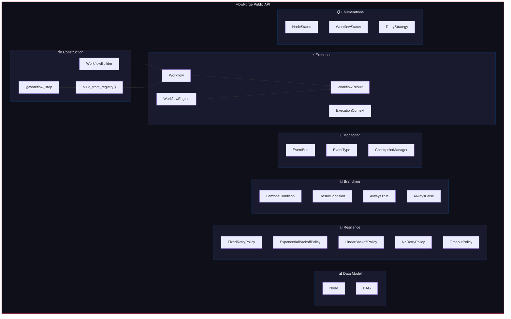

# FlowForge — User Documentation

## Table of Contents

1. [Overview](#1-overview)
2. [Installation](#2-installation)
3. [Quick Start](#3-quick-start)
4. [Public API Diagram](#4-public-api-diagram)
5. [Core Concepts](#5-core-concepts)
6. [Usage Guide](#6-usage-guide)
7. [API Reference](#7-api-reference)
8. [Configuration](#8-configuration)
9. [Error Handling](#9-error-handling)
10. [Best Practices](#10-best-practices)

---

## 1. Overview

FlowForge is a Python library for building and executing multi-step workflows as Directed Acyclic Graphs (DAGs). It is designed to be:

- **Embeddable** — integrates into any Python application
- **Dependency-free** — built entirely on the Python standard library
- **Pythonic** — clean API with builder pattern and decorators
- **Resilient** — retry policies, timeouts, and checkpointing built in
- **Observable** — rich event system for monitoring and logging

### When to Use FlowForge

| Use Case | FlowForge? |
|----------|------------|
| Multi-step data processing pipelines | ✅ Yes |
| ETL workflows within an application | ✅ Yes |
| Task orchestration with dependencies | ✅ Yes |
| Background job processing with retries | ✅ Yes |
| Distributed cross-server workflows | ❌ Use Airflow/Prefect |
| Simple sequential scripts | ❌ Overkill |

---

## 2. Installation

### Requirements

- Python ≥ 3.9
- No external dependencies

### Install from Source

```bash
# Clone or download the project
cd flowforge-project

# Install in development mode
pip install -e .

# Or install dependencies manually (none required for core)
# For development/testing:
pip install pytest
```

### Verify Installation

```python
import flowforge
print(flowforge.__version__)  # 1.0.0
```

---

## 3. Quick Start

```python
from flowforge import WorkflowBuilder

# Define your step functions
def extract(ctx):
    """Each step receives an ExecutionContext."""
    return [1, 2, 3, 4, 5]

def transform(ctx):
    """Access results from previous steps."""
    data = ctx.get_node_result("extract")
    return [x ** 2 for x in data]

def load(ctx):
    data = ctx.get_node_result("transform")
    print(f"Processed {len(data)} items: {data}")
    return {"count": len(data)}

# Build and run the workflow
result = (
    WorkflowBuilder("my_pipeline")
    .add_step("extract", extract)
    .add_step("transform", transform, depends_on=["extract"])
    .add_step("load", load, depends_on=["transform"])
    .build()
    .run()
)

print(result.status)        # WorkflowStatus.COMPLETED
print(result.is_success)    # True
print(result.node_results)  # {'extract': [1,2,3,4,5], 'transform': [1,4,9,16,25], 'load': {'count': 5}}
```

---

## 4. Public API Diagram



---

## 5. Core Concepts

### 5.1 Nodes

A **Node** represents a single step in your workflow. It wraps a Python function and enriches it with:

- **Status tracking** — PENDING → READY → RUNNING → COMPLETED/FAILED/SKIPPED
- **Retry policies** — automatic retry on failure
- **Timeout** — maximum execution duration
- **Conditions** — runtime gates that determine if the node runs

```python
from flowforge import Node

def my_step(ctx):
    return "hello"

node = Node("step_1", my_step, name="My First Step")
```

### 5.2 DAG (Directed Acyclic Graph)

The **DAG** is the structural backbone of a workflow. It holds nodes and their dependency relationships.

```python
from flowforge import DAG, Node

dag = DAG("my_workflow")
dag.add_node(Node("a", step_a))
dag.add_node(Node("b", step_b))
dag.add_edge("a", "b")  # b depends on a
```

Key operations:
- `topological_sort()` — valid execution order
- `get_ready_nodes()` — nodes eligible to run
- `validate()` — check for errors before execution

### 5.3 ExecutionContext

The **ExecutionContext** is a thread-safe data container shared across all nodes.

```python
from flowforge import ExecutionContext

ctx = ExecutionContext({"env": "production"})

# In a node function:
def my_step(ctx):
    env = ctx.get("env")                       # Read shared data
    previous = ctx.get_node_result("step_1")   # Read previous node's result
    ctx.set("my_key", "my_value")              # Write shared data
    return "done"
```

### 5.4 WorkflowEngine

The **WorkflowEngine** orchestrates DAG execution with parallel scheduling, retry management, and event emission.

```python
from flowforge import WorkflowEngine

engine = WorkflowEngine(
    max_workers=4,       # Thread pool size
    fail_fast=True,      # Stop on first failure
)
result = engine.run(dag, ctx)
```

---

## 6. Usage Guide

### 6.1 Builder API (Recommended)

The builder provides the cleanest way to construct workflows:

```python
from flowforge import WorkflowBuilder, ExponentialBackoffPolicy, ResultCondition

workflow = (
    WorkflowBuilder("data_pipeline")
    
    # Step 1: Extract
    .add_step("extract", extract_fn, name="Extract Data")
    
    # Step 2: Validate (depends on extract)
    .add_step("validate", validate_fn, depends_on=["extract"])
    
    # Step 3: Transform (with retry, depends on validate)
    .add_step(
        "transform",
        transform_fn,
        depends_on=["validate"],
        retry=ExponentialBackoffPolicy(max_retries=3, base_delay=1.0),
    )
    
    # Step 4: Load (conditional, only if validation passed)
    .add_step(
        "load",
        load_fn,
        depends_on=["transform"],
        condition=ResultCondition("validate", expected_value=True),
    )
    
    # Configure engine
    .max_workers(4)
    .fail_fast(True)
    
    # Register event callbacks
    .on_complete(lambda e: print("Pipeline done!"))
    .on_failure(lambda e: alert_team(e.data))
    
    .build()
)

result = workflow.run()
```

### 6.2 Decorator API

For a more declarative style:

```python
from flowforge import workflow_step, build_from_registry, clear_registry

clear_registry()  # Clean slate

@workflow_step("extract", name="Extract Data")
def extract(ctx):
    return fetch_records()

@workflow_step("transform", depends_on=["extract"])
def transform(ctx):
    data = ctx.get_node_result("extract")
    return process(data)

@workflow_step("load", depends_on=["transform"])
def load(ctx):
    data = ctx.get_node_result("transform")
    save(data)

# Build from all registered steps
workflow = build_from_registry("my_pipeline")
result = workflow.run()
```

### 6.3 Parallel Execution

Independent nodes automatically run in parallel:

```python
workflow = (
    WorkflowBuilder("parallel_demo")
    .add_step("fetch", fetch_data)
    .add_step("process_a", process_a, depends_on=["fetch"])  # ┐
    .add_step("process_b", process_b, depends_on=["fetch"])  # ├ Run in parallel
    .add_step("process_c", process_c, depends_on=["fetch"])  # ┘
    .add_step("merge", merge, depends_on=["process_a", "process_b", "process_c"])
    .max_workers(3)
    .build()
)
```

### 6.4 Retry Policies

```python
from flowforge import (
    FixedRetryPolicy,
    ExponentialBackoffPolicy,
    LinearBackoffPolicy,
    NoRetryPolicy,
)

# Fixed delay: retry 3 times, 2s between each
fixed = FixedRetryPolicy(max_retries=3, delay=2.0)

# Exponential backoff: 1s, 2s, 4s, 8s... capped at 60s
exponential = ExponentialBackoffPolicy(max_retries=5, base_delay=1.0, max_delay=60.0)

# Linear backoff: 2s, 4s, 6s, 8s... capped at 30s
linear = LinearBackoffPolicy(max_retries=4, base_delay=2.0, max_delay=30.0)

# Retry only on specific exceptions
selective = FixedRetryPolicy(
    max_retries=3,
    delay=1.0,
    retry_on=(ConnectionError, TimeoutError),
)
```

### 6.5 Conditional Branching

```python
from flowforge import LambdaCondition, ResultCondition

# Lambda-based condition
prod_only = LambdaCondition(lambda ctx: ctx.get("env") == "production")

# Result-based condition
is_valid = ResultCondition("validator", expected_value=True)
high_score = ResultCondition("scorer", expected_value=80, operator="gte")

# Composable conditions
complex_cond = is_valid & high_score          # AND
either_cond = is_valid | high_score            # OR
inverted = ~is_valid                           # NOT
```

### 6.6 Event Monitoring

```python
from flowforge import EventBus, EventType

bus = EventBus()

# Subscribe to specific events
bus.on(EventType.NODE_COMPLETED, lambda e: print(f"Done: {e.node_id}"))
bus.on(EventType.NODE_FAILED, lambda e: alert(e.data["error"]))
bus.on(EventType.WORKFLOW_COMPLETED, lambda e: report(e.data))

# Subscribe to ALL events
bus.on_any(lambda e: log(e))

# Enable event history
bus.enable_history()
# ... run workflow ...
for event in bus.history:
    print(event)
```

### 6.7 Checkpointing

```python
from flowforge import WorkflowEngine, CheckpointManager

cp_mgr = CheckpointManager()
engine = WorkflowEngine(checkpoint_manager=cp_mgr)

# During execution, pause and save
checkpoint_id = engine.pause(dag, context)

# Later, resume from checkpoint
result = engine.resume(dag, checkpoint_id)

# List all checkpoints
for cp in cp_mgr.list_checkpoints():
    print(f"{cp.checkpoint_id}: {cp.workflow_name} at {cp.created_at}")

# Clean up
cp_mgr.delete(checkpoint_id)
```

### 6.8 Timeouts

```python
from flowforge import TimeoutPolicy

# Node must complete within 30 seconds
timeout = TimeoutPolicy(timeout_seconds=30.0)

workflow = (
    WorkflowBuilder("timeout_demo")
    .add_step("slow_step", slow_fn, timeout=timeout)
    .build()
)
```

---

## 7. API Reference

### 7.1 WorkflowBuilder

| Method | Parameters | Returns | Description |
|--------|-----------|---------|-------------|
| `__init__` | `name`, `description=""` | `WorkflowBuilder` | Create a new builder |
| `add_step` | `step_id`, `func`, `name=`, `depends_on=`, `retry=`, `timeout=`, `condition=`, `metadata=` | `self` | Add a workflow step |
| `max_workers` | `n: int` | `self` | Set thread pool size |
| `fail_fast` | `enabled: bool` | `self` | Enable/disable fail-fast |
| `event_bus` | `bus: EventBus` | `self` | Use custom event bus |
| `on_start` | `callback` | `self` | Register start callback |
| `on_complete` | `callback` | `self` | Register completion callback |
| `on_failure` | `callback` | `self` | Register failure callback |
| `build` | — | `Workflow` | Build and validate |

### 7.2 Workflow

| Method | Parameters | Returns | Description |
|--------|-----------|---------|-------------|
| `run` | `context=None` | `WorkflowResult` | Execute the workflow |
| `pause` | `context=None` | `str` | Pause and checkpoint |
| `resume` | `checkpoint_id: str` | `WorkflowResult` | Resume from checkpoint |
| `cancel` | — | `None` | Cancel execution |

### 7.3 WorkflowResult

| Property/Field | Type | Description |
|----------------|------|-------------|
| `status` | `WorkflowStatus` | Final status |
| `is_success` | `bool` | `True` if completed |
| `context` | `ExecutionContext` | Final context |
| `node_results` | `dict[str, Any]` | Results by node ID |
| `errors` | `dict[str, Exception]` | Errors by node ID |
| `duration_seconds` | `float` | Wall-clock time |
| `started_at` | `datetime` | Start timestamp |
| `completed_at` | `datetime` | End timestamp |

### 7.4 ExecutionContext

| Method | Parameters | Returns | Description |
|--------|-----------|---------|-------------|
| `set` | `key: str, value: Any` | `None` | Store a value |
| `get` | `key: str, default=None` | `Any` | Retrieve a value |
| `has` | `key: str` | `bool` | Check key existence |
| `set_node_result` | `node_id, result` | `None` | Store node result |
| `get_node_result` | `node_id, default=None` | `Any` | Get node result |
| `snapshot` | — | `dict` | Deep-copy state |
| `from_snapshot` | `snap: dict` | `ExecutionContext` | Restore from snapshot |

### 7.5 EventType Enumeration

| Event | When Emitted |
|-------|-------------|
| `WORKFLOW_STARTED` | `engine.run()` begins |
| `WORKFLOW_COMPLETED` | All nodes done |
| `WORKFLOW_FAILED` | Fatal failure |
| `WORKFLOW_PAUSED` | `engine.pause()` |
| `WORKFLOW_RESUMED` | `engine.resume()` |
| `WORKFLOW_CANCELLED` | `engine.cancel()` |
| `NODE_STARTED` | Node begins execution |
| `NODE_COMPLETED` | Node returns successfully |
| `NODE_FAILED` | Node fails fatally |
| `NODE_RETRYING` | Node retrying after failure |
| `NODE_SKIPPED` | Node skipped (condition=False) |
| `CHECKPOINT_SAVED` | Checkpoint created |
| `CHECKPOINT_RESTORED` | Checkpoint restored |

---

## 8. Configuration

### Engine Configuration

| Option | Default | Description |
|--------|---------|-------------|
| `max_workers` | `4` | Thread pool size for parallel execution |
| `fail_fast` | `True` | Stop entire workflow on first node failure |
| `event_bus` | `EventBus()` | Custom event bus instance |
| `checkpoint_manager` | `CheckpointManager()` | Custom checkpoint manager |

### Retry Policy Configuration

| Policy | Parameters | Default Values |
|--------|-----------|----------------|
| `FixedRetryPolicy` | `max_retries`, `delay`, `retry_on` | `3`, `1.0s`, `None` |
| `ExponentialBackoffPolicy` | `max_retries`, `base_delay`, `max_delay`, `retry_on` | `3`, `1.0s`, `60.0s`, `None` |
| `LinearBackoffPolicy` | `max_retries`, `base_delay`, `max_delay`, `retry_on` | `3`, `1.0s`, `30.0s`, `None` |

---

## 9. Error Handling

### Exception Hierarchy

```
FlowForgeError (base)
├── CyclicDependencyError      — cycle detected in DAG
├── DuplicateNodeError         — node ID already exists
├── InvalidNodeError           — referenced node not found
├── NodeExecutionError         — node callable raised
├── WorkflowTimeoutError       — timeout exceeded
├── CheckpointError            — checkpoint save/restore failed
└── WorkflowValidationError    — DAG validation failed
```

### Handling Errors

```python
from flowforge import FlowForgeError, CyclicDependencyError

try:
    result = workflow.run()
    if not result.is_success:
        for node_id, error in result.errors.items():
            print(f"Node '{node_id}' failed: {error}")
except CyclicDependencyError as e:
    print(f"Invalid workflow: {e}")
except FlowForgeError as e:
    print(f"FlowForge error: {e}")
```

---

## 10. Best Practices

### Step Function Design

```python
# ✅ Good: Pure function, uses context for I/O
def transform(ctx):
    data = ctx.get_node_result("extract")
    return [process(item) for item in data]

# ❌ Bad: Uses global state
GLOBAL_DATA = []
def transform(ctx):
    GLOBAL_DATA.append(ctx.get("item"))  # Not thread-safe!
```

### Error Recovery

```python
# ✅ Good: Specific retry_on for transient errors
retry=FixedRetryPolicy(
    max_retries=3,
    retry_on=(ConnectionError, TimeoutError),
)

# ❌ Bad: Retry on all errors (masks bugs)
retry=FixedRetryPolicy(max_retries=10)
```

### Workflow Granularity

```python
# ✅ Good: Each step does one thing
.add_step("fetch", fetch_data)
.add_step("validate", validate_data)
.add_step("transform", transform_data)
.add_step("load", load_data)

# ❌ Bad: Monolithic step
.add_step("do_everything", fetch_validate_transform_load)
```

---

*FlowForge v1.0.0 — User Documentation*
